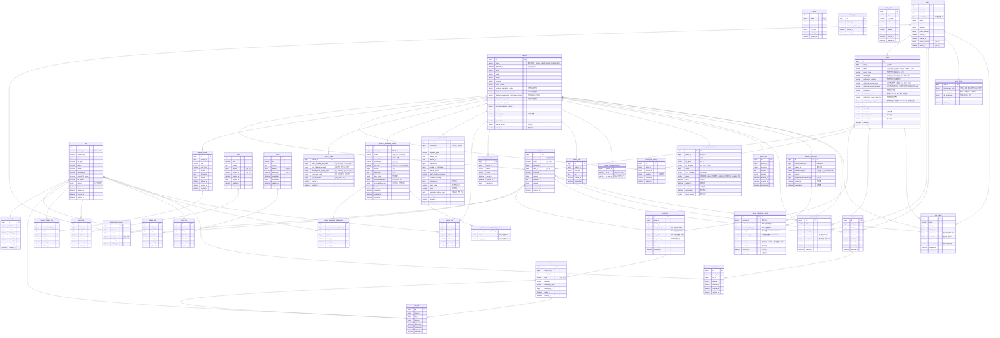

```mermaid
erDiagram
    admin {
        bigint id PK
        varchar name "이름"
        varchar email
        varchar password
        varchar role_type
        datetime created_at
        datetime updated_at
    }

    banner_file {
        bigint id PK
        bigint file_id
        tinyint deleted
        datetime deleted_at
        bigint deleted_by
        datetime created_at
        varchar created_by
        datetime updated_at
    }

    bidding {
        bigint id PK
        tinyint automated "자동견적여부"
        varchar status "입찰 상태"
        bigint partner_id
        bigint order_id "입찰 ID"
        varchar cost_type
        bigint amount
        text message
        tinyint deleted
        datetime created_at
        datetime updated_at
    }

    bidding_file {
        bigint id PK
        bigint bidding_id
        bigint file_id
        tinyint deleted
        datetime deleted_at
        datetime created_at
        datetime updated_at
    }

    bidding_price {
        bigint id PK
        bigint bidding_price
        varchar automated_bidding_price
        datetime created_at
        datetime updated_at
    }

    bidding_push_history {
        bigint id PK
        bigint bidding_id
        bigint user_id
        tinyint read_yn "읽음 여부"
        datetime created_at
        datetime updated_at
    }

    chat {
        bigint id PK
        bigint chat_room_id
        bigint chat_file_id
        varchar type "채팅 타입"
        varchar message
        varchar messenger_type
        bigint messenger_id
        datetime created_at
        datetime updated_at
    }

    chat_file {
        bigint id PK
        bigint chat_id
        bigint file_id
        tinyint deleted
        datetime deleted_at
        datetime created_at
        datetime updated_at
    }

    chat_room {
        bigint id PK
        bigint order_id
        bigint bidding_id
        tinyint user_bookmark "유저 즐겨찾기 여부"
        tinyint partner_bookmark "파트너 즐겨찾기 여부"
        tinyint user_joined "유저 채팅방 입장 여부"
        datetime last_chatted_at "마지막 채팅 시간"
        tinyint closed
        datetime closed_at
        datetime created_at
        datetime updated_at
    }

    files {
        bigint id PK
        varchar external_id "External ID"
        varchar content_type
        tinyint private
        varchar file_type
        varchar region
        varchar bucket
        varchar upload_path
        varchar original_file_name
        varchar file_name
        tinyint owned "주인존재여부"
        tinyint deleted
        datetime deleted_at
        datetime created_at
        datetime updated_at
    }

    frequent_bidding {
        bigint id PK
        bigint partner_id
        varchar title
        varchar cost_type
        bigint amount
        text description
        tinyint deleted
        datetime deleted_at
        datetime created_at
        datetime updated_at
    }

    frequent_bidding_file {
        bigint id PK
        bigint frequent_bidding_id
        bigint file_id
        tinyint deleted
        datetime deleted_at
        datetime created_at
        datetime updated_at
    }

    news {
        bigint id PK
        varchar title
        text content
        tinyint deleted "삭제 여부"
        datetime deleted_at "삭제 일시"
        datetime created_at
        bigint created_by
        datetime updated_at
        bigint updated_by
    }

    news_file {
        bigint id PK
        bigint news_id
        bigint file_id
        tinyint deleted
        datetime deleted_at
        datetime created_at
        datetime updated_at
    }

    notice {
        bigint id PK
        varchar title
        text content
        tinyint deleted "삭제 여부"
        datetime deleted_at "삭제 일시"
        datetime created_at
        bigint created_by
        datetime updated_at
        bigint updated_by
    }

    notice_file {
        bigint id PK
        bigint notice_id
        bigint file_id
        tinyint deleted
        datetime deleted_at
        datetime created_at
        datetime updated_at
    }

    order_push_history {
        bigint id PK
        bigint order_id
        bigint partner_id
        tinyint read_yn "읽음 여부"
        datetime created_at
        datetime updated_at
    }

    orders {
        bigint id PK
        bigint user_id "유저 ID"
        varchar status "입찰 상태 （입찰대기, 예약중, 예약취소, 완료）"
        varchar service_type "방역 유형（해충, 소독, 드론）"
        varchar space_type "방역 공간（주거, 상업, 사무, 교육, 기타）"
        varchar disinfection_locations "방역 위치（실내, 외부）"
        varchar additional_service_types "추가 방역 유형（（해충, 소독, 드론, 기타）"
        varchar additional_service_message "추가 방역 요청사항 （기타인 경우만 존재, 나머지 null）"
        varchar space_area "방역 공간 면적"
        varchar disinfection_period "방역 주기（1회, 정기, 방역 후 결정）"
        varchar disinfection_expect_date_type "방역 희망일 유형"
        date disinfection_expect_date "방역 희망일（유형이 SPECIFIC인 경우만 존재）"
        varchar si_do
        varchar si_gun_gu
        varchar comment "문의사항"
        varchar cancel_reason "취소사유"
        datetime canceled_at "취소일자"
        datetime created_at
        datetime updated_at
    }

    partner_alarm {
        bigint partner_id PK
        tinyint order_message_app_push "주문,메시지 앱 푸시 수신 여부"
        tinyint auto_bidding_app_push "자동견적 앱푸시 수신여부"
        tinyint review_profile_tip_app_push "리뷰 프로필 팁 앱푸시 수신여부"
        tinyint notice_app_push "방플 소식 앱푸시 수신여부"
        tinyint do_not_disturb "방해금지모드 여부"
        datetime created_at
        datetime updated_at
    }

    partner_automated_bidding {
        bigint id PK
        bigint partner_id "파트너 ID"
        varchar status "자동 견적 활성화 상태"
        varchar service_types "서비스 유형"
        varchar space_types "공간 유형"
        varchar cost_type "가격 유형（시간당/총비용）"
        bigint amount "가격"
        text description "설명"
        bigint daily_budget "일일 예산"
        bigint today_paid_budget "오늘 사용된 예산"
        bigint today_bidding_count "오늘 자동 입찰한 갯수"
        tinyint deleted
        datetime created_at
        datetime updated_at
        datetime deleted_at
    }

    partner_automated_bidding_file {
        bigint id PK
        bigint partner_automated_bidding_id
        bigint file_id
        tinyint deleted
        datetime deleted_at
        datetime created_at
        datetime updated_at
    }

    partner_automated_bidding_regions {
        bigint partner_automated_bidding_id
        varchar si_do "이동가능한 시도"
        varchar si_gun_gu "이동가능한 시군구"
    }

    partner_details {
        bigint partner_id PK
        bigint profile_file_id "프로필사진 파일ID"
        tinyint self_authenticated
        varchar payment_types
        time callable_from
        time callable_to
        bigint experienced
        bigint number_of_employees
        tinyint can_tax_invoice
        varchar short_introduce_message
        text introduce_message
        bigint review_count "리뷰 갯수"
        datetime latest_bid_at "최근 입찰 시점"
        decimal score "리뷰 평점"
        bigint completed_bidding_count "거래종료된 입찰 갯수"
        datetime created_at
        datetime updated_at
        tinyint admin_used
    }

    partner_file {
        bigint id PK
        bigint partner_id
        bigint file_id
        tinyint deleted
        datetime deleted_at
        datetime created_at
        datetime updated_at
    }

    partner_issue_history {
        bigint id PK
        bigint partner_id
        varchar status
        varchar reason
        datetime created_at
        datetime updated_at
        bigint created_by
    }

    partner_link {
        bigint id PK
        bigint partner_id
        varchar site_type
        text url
        datetime created_at
        datetime updated_at
    }

    partner_movable_regions {
        bigint partner_id
        varchar si_do "이동가능한 시도"
        varchar si_gun_gu "이동가능한 시군구"
    }

%% 파트너 결제 내역
    partner_payment_history {
        bigint id PK "ID"
        bigint partner_id "파트너 ID"
        varchar payment_id "결제 Unique ID"
        varchar pay_gate "PG 사"
        varchar pay_gate_key "PG 사 고유 결제 키"
        bigint amount
        varchar error_message "에러 메시지"
        varchar status "결제 상태 - READY: 결제 예정, CONFIRM: 결제 완료, CANCEL: 취소"
        datetime paid_at "결제일시"
        datetime created_at "생성일자"
        datetime updated_at "수정일자"
        datetime canceled_at "취소 일시"
        varchar cancel_reason "취소 사유"
    }

    partner_qna {
        bigint id PK
        bigint partner_id
        varchar question
        text answer
        tinyint deleted
        datetime deleted_at
        datetime created_at
        datetime updated_at
    }

    partner_report {
        bigint id PK
        varchar status
        bigint order_id
        bigint bidding_id
        bigint partner_id "신고한 파트너 ID"
        bigint user_id "신고 당한 파트너 ID"
        varchar reason
        datetime created_at
        datetime updated_at
    }

%%  파트너 거래 내역 
    partner_transaction {
        bigint id PK "ID"
        bigint request_bidding_id " Bidding ID "
        bigint partner_id " 파트너 ID "
        varchar transaction_type " 트랜잭션 유형（EARN/ USE） "
        bigint amount
        bigint ref_partner_transaction_id " 참조 ID "
        datetime created_at " 생성일자 "
        datetime updated_at " 수정일자 "
    }

%%  파트너 거래 상세 내역 
    partner_transaction_detail {
        bigint id PK " ID "
        bigint partner_id " 파트너 ID "
        bigint partner_transaction_id " 파트너 트랜잭션 ID "
        bigint request_bidding_id "캐시사용 입찰 ID"
        varchar cash_type " 캐시 유형（NORMAL/BONUS） "
        varchar transaction_type " 트랜잭션 유형（EARN/ USE） "
        bigint amount
        varchar earn_tag " 유효기간（6자리）+캐시유형（2자리） "
        datetime expired_at " 만료일자 "
        datetime created_at " 생성일자 "
        datetime updated_at " 수정일자 "
    }

    partners {
        bigint id PK
        varchar status "파트너 상태 （ISSUE_READY/ISSUE_COMPLETED）"
        datetime approved_at "심사완료 일시"
        varchar name
        varchar email
        varchar gender
        varchar password
        varchar phone_number
        varchar business_registration_number "사업자 등록번호"
        varchar disinfection_certification_number "소독자격증 번호"
        varchar disinfection_education_certification_number "방역교육이수증 번호"
        varchar drone_license_number "드론자격증 번호"
        varchar land_lot_based_address
        varchar road_name_based_address
        varchar post_code
        varchar service_types "서비스유형"
        datetime created_at
        datetime updated_at
        varchar deleted_reason "탈퇴사유"
        datetime deleted_at "탈퇴 시간"
    }

    public_offices {
        bigint id PK
        varchar si_do
        varchar si_gun_gu
        varchar name
        bigint post_code
        varchar address
        geometry point
        datetime created_at
        datetime updated_at
    }

    review {
        bigint id PK
        bigint user_id
        bigint bidding_id
        decimal rate
        text content
        tinyint deleted
        datetime deleted_at
        datetime created_at
        datetime updated_at
    }

    review_file {
        bigint id PK
        bigint review_id
        bigint file_id
        tinyint deleted
        datetime deleted_at
        datetime created_at
        datetime updated_at
    }

    user_alarm {
        bigint user_id PK
        tinyint bidding_app_push "견적서 도착, 메시지 앱푸시 수신여부"
        tinyint notice_app_push "방플 소식 앱푸시 수신여부"
        tinyint do_not_disturb "방해금지모드 여부"
        datetime created_at
        datetime updated_at
    }

    user_report {
        bigint id PK
        varchar status
        bigint order_id
        bigint bidding_id
        bigint partner_id "신고 당한 파트너 ID"
        bigint user_id "신고한 유저 ID"
        varchar reason
        varchar reason_detail "신고 이유 상세"
        datetime created_at
        datetime updated_at
    }

    users {
        bigint id PK
        varchar naver_id
        bigint kakao_id
        bigint profile_file_id "프로필 파일 ID"
        varchar name
        varchar email
        varchar password
        varchar phone_number
        datetime created_at
        datetime updated_at
        varchar deleted_reason "탈퇴사유"
        datetime deleted_at "탈퇴 시간"
    }

    files ||--o{ banner_file : ""
    orders ||--o{ bidding : ""
    partners ||--o{ bidding : ""
    bidding ||--o{ bidding_file : ""
    files ||--o{ bidding_file : ""
    bidding ||--o{ bidding_push_history : ""
    users ||--o{ bidding_push_history : ""
    chat_file ||--o{ chat : ""
    chat_room ||--o{ chat : ""
    chat ||--o{ chat_file : ""
    files ||--o{ chat_file : ""
    bidding ||--o{ chat_room : ""
    orders ||--o{ chat_room : ""
    partners ||--o{ frequent_bidding : ""
    files ||--o{ frequent_bidding_file : ""
    frequent_bidding ||--o{ frequent_bidding_file : ""
    files ||--o{ news_file : ""
    news ||--o{ news_file : ""
    files ||--o{ notice_file : ""
    notice ||--o{ notice_file : ""
    orders ||--o{ order_push_history : ""
    partners ||--o{ order_push_history : ""
    users ||--o{ orders : ""
    partners ||--o{ partner_alarm : ""
    partners ||--o{ partner_automated_bidding : ""
    files ||--o{ partner_automated_bidding_file : ""
    partner_automated_bidding ||--o{ partner_automated_bidding_file : ""
    partner_automated_bidding ||--o{ partner_automated_bidding_regions : ""
    partners ||--o{ partner_details : ""
    files ||--o{ partner_file : ""
    partners ||--o{ partner_file : ""
    partners ||--o{ partner_issue_history : ""
    partners ||--o{ partner_link : ""
    partners ||--o{ partner_movable_regions : ""
    partners ||--o{ partner_payment_history : ""
    partners ||--o{ partner_qna : ""
    bidding ||--o{ partner_report : ""
    orders ||--o{ partner_report : ""
    partners ||--o{ partner_report : ""
    users ||--o{ partner_report : ""
    partners ||--o{ partner_transaction : ""
    partner_transaction ||--o{ partner_transaction_detail : ""
    partners ||--o{ partner_transaction_detail : ""
    bidding ||--o{ review : ""
    users ||--o{ review : ""
    files ||--o{ review_file : ""
    review ||--o{ review_file : ""
    users ||--o{ user_alarm : ""
    bidding ||--o{ user_report : ""
    orders ||--o{ user_report : ""
    partners ||--o{ user_report : ""
    users ||--o{ user_report : ""

```

